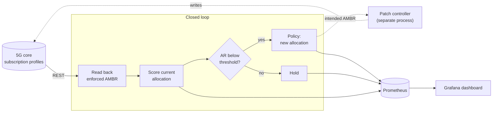

# Slice AMBR Closed Loop

Most published work on reinforcement learning for network slicing stops at a
reward curve in a notebook. This is the part that comes after: the control
loop that carries such a policy into a running 5G network — reading the core's
actual state back, deciding, exporting every decision as a metric, and
deploying as containers and Helm charts with the policy as a swappable
component.

The allocation policy is deliberately the *smallest* replaceable piece. It sits
behind a seven-member interface; everything else — the loop, the core client,
the exporter, the dashboards, the charts — is indifferent to whether the policy
is a learned one or three lines of arithmetic.

Built for the **FREE6G** research project at Nearby Computing.

> **On the learned policy:** the tabular Q-learning agent behind the published
> results was implemented by a colleague and is not included here — it is
> theirs to publish. The system design was joint work; the closed loop and
> everything around it is mine. A closed-form baseline ships so the system runs
> end to end. See [`agents/README.md`](agents/README.md).

## What it does

A 5G core enforces a per-slice **AMBR** (Aggregate Maximum Bit Rate) — a rate
ceiling. Set it once and it is wrong as soon as traffic moves: a slice with a
generous ceiling it never uses starves one that is turning demand away.

This loop watches the **acceptance ratio** — the fraction of offered demand
each slice can actually serve — and when it degrades past a threshold, asks the
policy for a new split of the shared budget.



Two design decisions are worth calling out, because both were learned the hard
way:

**The loop reads the core back every iteration rather than trusting its own
last decision.** A profile can be changed by an operator, by another
controller, or by a write that silently failed. A loop that assumes its last
command took effect will happily compute its next decision from fiction.

**Deciding and actuating are separate processes.** This process decides and
publishes; a separate patch controller writes to the core. A policy that goes
wrong can then only produce bad *metrics*, not a bricked core — and the
intended-vs-enforced gap becomes visible on the dashboard instead of invisible.

## Quick start

No cluster and no 5G core required — the loop degrades to logging fetch errors
and keeps running:

```bash
python3 -m venv .venv && . .venv/bin/activate
pip install -r requirements.txt

MAX_ITERATIONS=5 SIMULATION_INTERVAL=1 SLICE_PROFILE_MAP="0=6,1=7" \
  python -m simulator.closed_loop
```

Metrics are on `http://localhost:8999/metrics`:

```
slice_ambr_acceptance_ratio_static    0.75
slice_ambr_acceptance_ratio_dynamic   0.92
slice_ambr_dynamic_bitrate{slice_id="6"}  70
slice_ambr_static_bitrate{slice_id="6"}   50
```

Every reconfiguration is exported next to what a *fixed* allocation would have
achieved on the same demand sample, so the dashboard shows the delta the loop
is responsible for rather than an absolute number that flatters it.

## Configuration

All environment variables; nothing is baked into an image.

| Variable | Default | Meaning |
| --- | --- | --- |
| `SLICE_AGENT` | bundled baseline | Policy as `module.path:ClassName` |
| `RAEMIS_API_URL` | `https://192.0.2.10:...` | Core subscription-profile API (RFC 5737 placeholder) |
| `RAEMIS_USERNAME` / `RAEMIS_PASSWORD` | unset | Basic auth; omitted entirely when unset |
| `RAEMIS_VERIFY_TLS` | `true` | Only disable against a lab core with a self-signed cert |
| `SLICE_PROFILE_MAP` | `0=1,1=2` | Slice index to core profile id |
| `RECONFIG_TRIGGER_THRESHOLD` | `0.8` | Acceptance ratio below which the loop reconfigures |
| `INITIAL_AMBR` | `50` | Starting ceiling per slice |
| `SIMULATION_INTERVAL` | `25` | Seconds between iterations |
| `MAX_ITERATIONS` | `0` | `0` runs forever; a positive value stops after N |
| `PROMETHEUS_PORT` | `8999` | Exporter port |

The defaults are documentation addresses and empty credentials on purpose: a
half-configured deployment fails loudly rather than quietly talking to whatever
happens to answer at a baked-in IP.

## Deploying

```bash
kubectl create secret generic raemis-creds \
  --from-literal=username=<user> --from-literal=password=<pass>

helm install slice-sim charts/slice-simulator \
  --set core.apiUrl=https://<your-core>/api/subscription_profile \
  --set core.sliceProfileMap="0=6,1=7" \
  --set core.existingSecret=raemis-creds
```

Neither chart will take a credential through `values.yaml` — both read from a
Secret you create, and the Grafana chart refuses to render without one. Full
notes in [`docs/deployment.md`](docs/deployment.md).

## Swapping the policy

Implement the interface in [`agents/base.py`](agents/base.py) and point the
loop at your class:

```bash
export SLICE_AGENT="my_package.my_agent:MyQLearningAgent"
```

Nothing else changes — same exporter, same dashboards, same charts.

## Repository layout

| Path | |
| --- | --- |
| [`agents/`](agents/) | Policy interface and the bundled baseline |
| [`simulator/`](simulator/) | Control loop, core client, exporter, config |
| [`grafana/`](grafana/) | Dashboard definition and its install/remove tool |
| [`charts/`](charts/) | Helm charts |
| [`docker/`](docker/) | Container builds |
| [`tests/`](tests/) | Test suite |
| [`docs/`](docs/) | Architecture and deployment notes |

## Known limitations

Stated plainly, because they are the first things a reviewer would find:

- **Two slices in practice.** The interface and the baseline are written for
  N, but the exported metric vector and the dashboard panels assume two. More
  than two works but is not covered by tests.
- **Demand is synthetic.** `calculate_new_rand_demand()` draws from a uniform
  distribution. Against a real network this must be replaced with live
  counters; the interface is where you would do it.
- **The loop does not write to the core.** It decides and publishes; actuation
  is a separate patch controller, which is not part of this repository.
- **The discrete allocation grid is coarse** — ten-unit steps of a hundred-unit
  budget. It keeps the action space small enough for tabular methods, and it
  costs accuracy at the margin.
- **No hysteresis on the trigger.** Demand hovering at the threshold will
  reconfigure repeatedly. A real deployment wants a dwell time.
- **The published results are not reproducible here**, because the policy that
  produced them is not included.

## Acknowledgements

Produced for the **FREE6G** project at Nearby Computing. The Q-learning policy
behind the published results was implemented by a colleague; the system design
was joint work. See [`NOTICE`](NOTICE).

The original deployment integrated with a separate commercial orchestration
platform; that layer is proprietary and out of scope here.

## Licence

[Apache-2.0](LICENSE).
